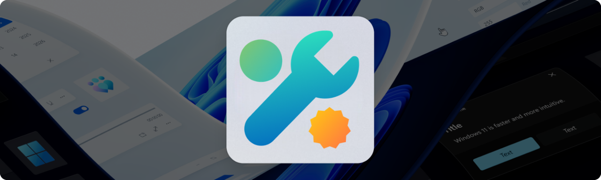



  

<h3 align="center">
<a href="../docs/INSTALL.md">Installation Guide</a> •
<a href="../docs/USER_GUIDE_INSTALLER.md">User Guide (Installer)</a> •
<a href="../docs/USER_GUIDE_SETTINGS.md">User Guide (Settings)</a> •
<a href="../docs/LICENSE_THIRD_PARTY.md">Credits & License</a>
</h3>

AutoOS is a Native AOT WinUI 3 application that automates migrating to a new Windows installation on a separate partition. With minimal user effort, it seamlessly configures a cleaner and faster system optimized for gaming performance and productivity while preserving all system compatibility.

## ✨ Introduction

> [!NOTE]  
> The following is a description of the AutoOS project, if you just want to install it, head to [Installation Guide](docs/INSTALL.md).

There are plenty of "Windows Debloat" scripts and apps out there, but most of them rely on basic CMD / PowerShell scripts / commands, apply non-researched tweaks, and end up breaking core Windows functionality or security.

There is also a lot of Discord Servers selling services to apply custom ISOs / playbooks that contain copy pasted tweaks or install poorly coded AI utilities that rely on poor research and public knowledge.

With AutoOS I have completely reimagined the way Windows is installed and used. AutoOS is written in **C#** and **WinUI3** while being fully **NativeAOT** compatible and utilizing **Win32 APIs**. It is tailored towards **competitive gamers** and **power users** while being **fully open source** and receiving **regular updates** that don't require you to reinstall Windows every time. All the changes are also applied to **new user accounts**, making it an **ideal choice** for **shared PCs**.

### The Installation Process
For the installation, users are provided with the latest `25H2 Professional ISO` which is built and updated by GitHub Actions using the `uupdump API`. Check out my [uup-dump-get-windows-iso](https://github.com/tinodin/uup-dump-get-windows-iso) repository.

The installation bypasses the need for unreliable and slow USB drives and instead relies on a PowerShell Script to create a new partition, apply the `install.wim`, add the custom `unattend.xml` file and create the boot entry.

The **unattend.xml** file does the following:
- Removes and disables 8.3 file names before installing Windows
- Creates a local user account
- Cleans up visual clutter
- Disables automatic driver/app installation via Windows Update
- Removes web results from Windows start menu
- Adjusts Registry and Group Policies for Privacy, Performance and QoL
- Precompiles .NET assemblies to improve PowerShell loading times
- Pauses Windows Updates for 100 years
- Adds Recycle Bin to Quick Access
- Sets the correct Timezone, Regional format, Keyboard Layout and secondary language for your country
- Downloads and installs the latest version of AutoOS

After Windows is installed you are greeted with the **AutoOS Installer**.

### AutoOS Installer
Pressing **Install AutoOS** in the **AutoOS Installer** does the following:
- Creates an optimized Power plan
- Disables selected Security features
- Downloads strips, installs and optimizes your selected Graphic Card drivers
- Imports the selected Custom Resolution Utility (CRU) profile
- Imports the monitor layout from the old Windows Installation
- Automatically sets your monitors to their highest supported refresh rates
- Imports the selected MSI Afterburner overclock profile
- Installs OBS Studio with optimal settings depending on your GPUs
- Adjusts your Ethernet and Wi-Fi adapters advanced settings
- Disables Audio Enhancements and optimizes MMCSS settings depending on your NIC driver
- Restores the Dolby AC-3 Feature on Demand to support Dolby Atmos on newer Windows Versions
- Automatically optimizes your Audio, GPU, XHCI and NIC Affinities depending on your CPU configuration
- Enables MSI mode for supported devices, disables XHCI Interrupt Moderation (IMOD) for all USB controllers
- Disables some unneeded Scheduled Tasks
- Disables some unneeded Optional Features
- Removes some unneeded Capabilities
- Uninstalls and deprovisions unneeded AppX packages and updates all installed AppX to their latest version
- Installs Visual C++ Redistributable, Microsoft Edge WebView2, .NET Desktop Runtimes, Microsoft Windows App Runtime and DirectX
- Installs selected Browsers with selected Browser Extensions
- Installs additional Image / Video Extensions
- Installs NanaZip, Everything, StartAllBack and Windhawk with Mods for Start Menu, Taskbar, File Explorer etc.
- Installs selected Apps for Messaging, Launchers, Music, Peripherals, Controllers, Development, Sysinternals, Overclocking, Music Production, Video Production, Office and Miscellaneous
- Imports Discord account and keybinds from old Installation, applies system theme and disables game overlay and clips
- Imports the Epic Games and Riot Games Account from the old Windows installation
- Imports / Links Epic Games, Riot Games and Steam titles from the old Windows installation
- Sets Fortnite frame rate depending on your main monitors refresh rate
- Cleans up temporary files and creates a restore point

After the **AutoOS Installer** is done you have a **fully optimized Windows installation** and the **AutoOS Settings** app.

On startup **AutoOS Startup** does the following:

### AutoOS Startup
- Syncs the time
- Applies the MSI Afterburner profile
- Applies sound buffer sizes for selected input and output devices
- Disables XHCI Interrupt Moderation (IMOD) for selected XHCI Controllers
- Launches OBS Studio if selected
- Cleans up temporary files

I have spent countless hours every day for 2 years building this project for myself and others. There is still some work to do and I am looking for contributors and suggestions to make this a big community project.

## 📜 License
This project is licensed under the **GNU General Public License v3.0**. Detailed information about third-party components and credits can be found in **[License & Credits](docs/LICENSE_THIRD_PARTY.md)**.
