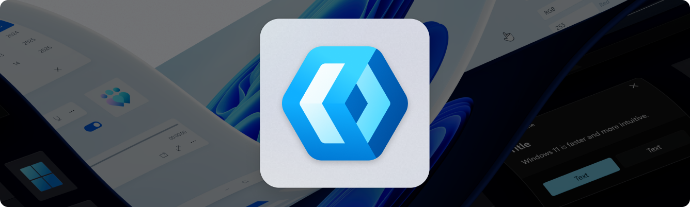

<h1 align="center">
    AutoOS
</h1>

<div align="center">

[](https://github.com/tinodin/AutoOS/releases/latest)
[](https://github.com/tinodin/AutoOS/releases)
[](https://discord.gg/ammDNveHzh)
[](https://www.paypal.com/donate/?hosted_button_id=GVEVUSHUWXEAG)

</div>

AutoOS is an open-source utility focused on easy automated installation, improving performance, privacy and compatibility. 


## ✨ Features
- 
- 


## 💻 System Requirements

AutoOS is currently only supported on x64 builds of Windows 11 23H2 `22631` and up.

## 🚀 Getting Started

> [!CAUTION]
> AutoOS only supports fresh installations of windows.

1. Download the latest `non Cumulative Update Preview` ISO (23H2) in x64 [UUP dump](https://uupdump.net/known.php?q=category%3Aw11-23h2), uncheck `Windows Home`, click next and check `Integrate .NET Framework 3.5 (Windows converter only)`.
2. Download [Ventoy](https://sourceforge.net/projects/ventoy/files/latest/download)
3. 

## 📜 License

This project is licensed under the **GNU General Public License v3.0**. See the `LICENSE` file for details.

### Third-Party Components

1. **NSudo**
   - Licensed under the **MIT License**.
   - Source: [M2TeamArchived/NSudo](https://github.com/M2TeamArchived/NSudo)

2. **nvidiaProfileInspector**
   - Licensed under the **MIT License**.
   - Source: [Orbmu2k/nvidiaProfileInspector](https://github.com/Orbmu2k/nvidiaProfileInspector)

3. **DWMEnableMMCSS**
   - Licensed under the **GNU General Public License v3.0**.
   - Source: [Duckleeng/DWMEnableMMCSS](https://github.com/Duckleeng/DWMEnableMMCSS)

4. **TimerResolution**
   - Licensed under the **GNU General Public License v3.0**.
   - Source: [valleyofdoom/TimerResolution](https://github.com/valleyofdoom/TimerResolution)

5. **AutoGpuAffinity**
   - Licensed under the **GNU General Public License v3.0**.
   - Source: [valleyofdoom/AutoGpuAffinity](https://github.com/valleyofdoom/AutoGpuAffinity)
   - Changes: Added `--output-dir` switch because of MSIX restrictions.

6. **Service List Builder**
   - Licensed under the **GNU General Public License v3.0**.
   - Source: [valleyofdoom/service-list-builder](https://github.com/valleyofdoom/service-list-builder)
   - Changes: Removed `shutdown /r /t 0` from created lists, added `--output-dir` switch because of MSIX restrictions.

7. **LowAudioLatency**
    - Explicit permission granted by [sppdl](https://github.com/spddl)
    - Source: [sppdl/LowAudioLatency](https://github.com/spddl/LowAudioLatency)


8. **7-Zip**
```
  7-Zip Extra
  ~~~~~~~~~~~
  License for use and distribution
  ~~~~~~~~~~~~~~~~~~~~~~~~~~~~~~~~

  Copyright (C) 1999-2024 Igor Pavlov.

  7-Zip Copyright (C) 1999-2024 Igor Pavlov.

  The licenses for files are:

    - 7za.exe:
         - The "GNU LGPL" as main license for most of the code
         - The "BSD 3-clause License" for some code
         - The "BSD 2-clause License" for some code
    - All other files: the "GNU LGPL".

  Redistributions in binary form must reproduce related license information from this file.

  Note: 
        You can use 7-Zip Extra on any computer, including a computer in a commercial 
        organization. You don't need to register or pay for 7-Zip.

  It is allowed to digitally sign DLL and EXE files included into this package
  with arbitrary signatures of third parties.


GNU LGPL information
--------------------

    This library is free software; you can redistribute it and/or
    modify it under the terms of the GNU Lesser General Public
    License as published by the Free Software Foundation; either
    version 2.1 of the License, or (at your option) any later version.

    This library is distributed in the hope that it will be useful,
    but WITHOUT ANY WARRANTY; without even the implied warranty of
    MERCHANTABILITY or FITNESS FOR A PARTICULAR PURPOSE.  See the GNU
    Lesser General Public License for more details.

    You can receive a copy of the GNU Lesser General Public License from
    http://www.gnu.org/


BSD 3-clause License in 7-Zip code
----------------------------------

  The "BSD 3-clause License" is used for the following code in 7za.exe
    -  ZSTD data decompression.
       that code was developed using original zstd decoder code as reference code.
       The original zstd decoder code was developed by Facebook Inc,
       that also uses the "BSD 3-clause License".

  Copyright (c) Facebook, Inc. All rights reserved.
  Copyright (c) 2023-2024 Igor Pavlov.

Text of the "BSD 3-clause License"
----------------------------------

Redistribution and use in source and binary forms, with or without modification,
are permitted provided that the following conditions are met:

1. Redistributions of source code must retain the above copyright notice, this
   list of conditions and the following disclaimer.

2. Redistributions in binary form must reproduce the above copyright notice,
   this list of conditions and the following disclaimer in the documentation
   and/or other materials provided with the distribution.

3. Neither the name of the copyright holder nor the names of its contributors may
   be used to endorse or promote products derived from this software without
   specific prior written permission.

THIS SOFTWARE IS PROVIDED BY THE COPYRIGHT HOLDERS AND CONTRIBUTORS "AS IS" AND
ANY EXPRESS OR IMPLIED WARRANTIES, INCLUDING, BUT NOT LIMITED TO, THE IMPLIED
WARRANTIES OF MERCHANTABILITY AND FITNESS FOR A PARTICULAR PURPOSE ARE
DISCLAIMED. IN NO EVENT SHALL THE COPYRIGHT HOLDER OR CONTRIBUTORS BE LIABLE FOR
ANY DIRECT, INDIRECT, INCIDENTAL, SPECIAL, EXEMPLARY, OR CONSEQUENTIAL DAMAGES
(INCLUDING, BUT NOT LIMITED TO, PROCUREMENT OF SUBSTITUTE GOODS OR SERVICES;
LOSS OF USE, DATA, OR PROFITS; OR BUSINESS INTERRUPTION) HOWEVER CAUSED AND ON
ANY THEORY OF LIABILITY, WHETHER IN CONTRACT, STRICT LIABILITY, OR TORT
(INCLUDING NEGLIGENCE OR OTHERWISE) ARISING IN ANY WAY OUT OF THE USE OF THIS
SOFTWARE, EVEN IF ADVISED OF THE POSSIBILITY OF SUCH DAMAGE.

---


BSD 2-clause License in 7-Zip code
----------------------------------

  The "BSD 2-clause License" is used for the XXH64 code in 7za.exe.

  XXH64 code in 7-Zip was derived from the original XXH64 code developed by Yann Collet.

  Copyright (c) 2012-2021 Yann Collet.
  Copyright (c) 2023-2024 Igor Pavlov.

Text of the "BSD 2-clause License"
----------------------------------

Redistribution and use in source and binary forms, with or without modification,
are permitted provided that the following conditions are met:

1. Redistributions of source code must retain the above copyright notice, this
   list of conditions and the following disclaimer.

2. Redistributions in binary form must reproduce the above copyright notice,
   this list of conditions and the following disclaimer in the documentation
   and/or other materials provided with the distribution.

THIS SOFTWARE IS PROVIDED BY THE COPYRIGHT HOLDERS AND CONTRIBUTORS "AS IS" AND
ANY EXPRESS OR IMPLIED WARRANTIES, INCLUDING, BUT NOT LIMITED TO, THE IMPLIED
WARRANTIES OF MERCHANTABILITY AND FITNESS FOR A PARTICULAR PURPOSE ARE
DISCLAIMED. IN NO EVENT SHALL THE COPYRIGHT HOLDER OR CONTRIBUTORS BE LIABLE FOR
ANY DIRECT, INDIRECT, INCIDENTAL, SPECIAL, EXEMPLARY, OR CONSEQUENTIAL DAMAGES
(INCLUDING, BUT NOT LIMITED TO, PROCUREMENT OF SUBSTITUTE GOODS OR SERVICES;
LOSS OF USE, DATA, OR PROFITS; OR BUSINESS INTERRUPTION) HOWEVER CAUSED AND ON
ANY THEORY OF LIABILITY, WHETHER IN CONTRACT, STRICT LIABILITY, OR TORT
(INCLUDING NEGLIGENCE OR OTHERWISE) ARISING IN ANY WAY OUT OF THE USE OF THIS
SOFTWARE, EVEN IF ADVISED OF THE POSSIBILITY OF SUCH DAMAGE.

---
```
- Source: [7-Zip](https://www.7-zip.org)
 
9. **Custom Resolution Utility (CRU)**
```
Copyright (C) 2012-2022 ToastyX
https://monitortests.com/custom-resolution-utility

Permission is hereby granted, free of charge, to any person obtaining a copy
of this software the rights to use, copy, and/or distribute copies of the
software subject to the following conditions:

The above copyright notice and this permission notice shall be included in
all copies of the software.

THE SOFTWARE IS PROVIDED "AS IS" WITHOUT WARRANTY OF ANY KIND, EXPRESS OR
IMPLIED. IN NO EVENT SHALL THE AUTHOR BE LIABLE FOR ANY CLAIM, DAMAGES, OR
OTHER LIABILITY IN CONNECTION WITH THE USE OF THE SOFTWARE.
```
- Source: [Custom Resolution Utility (CRU)](https://monitortests.com/custom-resolution-utility)

10. **DeviceCleanup**
```
Allowed:
- usage in any environment, including commercial
- include in software products, including commercial
- include on CD/DVD of computer magazines

Not allowed:
- modify any of the files
- offer for download by means of a "downloader" software
```
- Source: [DeviceCleanup](https://www.uwe-sieber.de/misc_tools.html#devicecleanup)

11. **DriveCleanup**
```
Allowed:
- usage in any environment, including commercial
- include in software products, including commercial
- include on CD/DVD of computer magazines

Not allowed:
- modify any of the files
- offer for download by means of a "downloader" software
```
- Source: [DriveCleanup](https://www.uwe-sieber.de/drivetools.html#drivecleanup)

12. **RwEverything**
- Have to ask for permission ._.